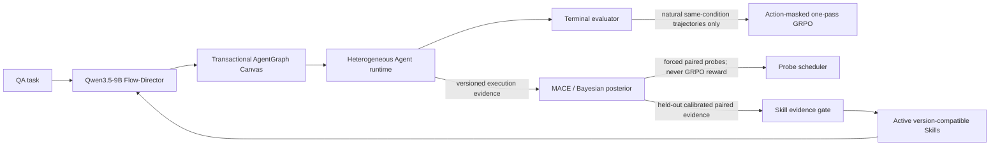

# FlowSteer AgentGraph v1 architecture scaffold

This directory documents the code architecture built from the FlowSteer, MACE,
MANTA, and SkillFlow references plus the project design note. Reference
documents are design inputs, not runtime instructions.  The exact code-source
boundaries are recorded in [SOURCE_MAP.md](SOURCE_MAP.md).

The checked-in configuration is intentionally `architecture_only`: it can be
loaded, validated, imported, and fake-tested without starting SGLang, loading a
model, calling a paid API, or running an optimizer.

## What is implemented

AgentGraph v1 is an additive path beside the repository's original Operator
DSL. The legacy trainer and evaluator are intentionally left intact while the
new path establishes stricter execution and evidence invariants.

| Plane | Implemented modules | Current boundary |
| --- | --- | --- |
| Execution | `agent_graph`, `agent_action_parser`, `agent_workflow_env`, `agent_runtime`, `openai_gateway`, `director` | End-to-end inference works with fake gateways; real endpoints remain opt-in |
| Qwen runtime | `sglang_manager`, `start_qwen35_director_server.sh` | SkillFlow-style Qwen3.5-9B SGLang boundary exists; no server starts during validation |
| Policy learning | `grpo_objective`, `records` | Objective primitives exist but `grpo.enabled=false`; no GPU trainer is connected |
| Exploration | `exploration/features`, `mace`, `posterior`, `policies`, `paired_probe`, `evsi` | Inactive algorithm primitives only; no worker or online update loop |
| Skills | `skills/schema`, `validator`, `store`, `retrieval`, `lifecycle` | Inactive data/evidence primitives only; no mining or publication loop |
| Evidence | `persistence/ids`, `trajectory_store`, `replay`, `versioning` | Versioned JSONL streams, idempotency, split isolation, and snapshot hash-chain replay are implemented |

The design deliberately keeps three signals separate:



## Hard invariants

- Agent IDs are unique, model IDs come from the catalog, and contracts are
  non-empty.
- Relations are two directed bits: independent, either one-way direction, or
  bidirectional.
- A bidirectional block contains at most two Agents and executes as two frozen
  stages: parallel drafts, then parallel revisions over the peer's draft.
- The quotient graph is acyclic; every block reaches one output block, which is
  a sink.
- The Director emits one strict JSON action per turn. The parser consumes only
  the first action boundary.
- GRPO groups use `(task_id, condition_id, policy_version)`. Singleton and
  constant-reward groups have zero advantage.
- Forced probes, fallbacks, manual repairs, reconstructed contexts, invalid
  evaluators, and mismatched behavior receipts are excluded from GRPO.
- A natural trajectory contributes no more than one terminal posterior
  likelihood. Local effects come primarily from paired interventions.
- Test examples cannot enter probe, posterior-fitting, calibration, or Skill
  evidence streams.
- A Skill is structured and version-bound. It activates only after held-out
  evidence passes deterministic gates and only in a later exploration epoch.

## Qwen3.5 runtime and three-GPU layout

FlowSteer's Qwen3-8B vLLM launcher is not used for the new Director.  The
Supervisor service follows SkillFlow's Qwen3.5-9B SGLang process boundary.
The default physical cards are 3, 4, and 5; they are configured by physical
index and must not be combined with a conflicting `CUDA_VISIBLE_DEVICES`
remap.

| Physical GPU | Role | Default environment variable |
| ---: | --- | --- |
| 3 | Learner model, LoRA parameters, optimizer/partition state (future) | `FLOWSTEER_LEARNER_GPU` |
| 4 | Qwen3.5-9B SGLang Supervisor rollout | `FLOWSTEER_ROLLOUT_GPU` |
| 5 | Full-model gradient replica and split backward items (future) | `FLOWSTEER_GRADIENT_GPU` |

Validate availability:

```bash
python3 scripts/check_gpu_plan.py
```

Run an arbitrary process under one role without relying on ambiguous device
numbering:

```bash
scripts/run_on_gpu_role.sh learner python3 your_future_training_entry.py
scripts/run_on_gpu_role.sh gradient python3 your_future_gradient_worker.py
```

Start the Director inference service:

```bash
python3 -m pip install -r requirements-qwen35-runtime.txt
export QWEN35_9B_MODEL_PATH=/absolute/path/to/Qwen3.5-9B
scripts/start_qwen35_director_server.sh
```

This command is not run by setup validation.  It uses SkillFlow's SGLang
defaults (`qwen3` reasoning parser, `qwen3_coder` tool parser, LoRA rank 64,
32K scaffold context).  Context and memory fraction remain environment
overrides because a real value must be chosen against the installed SGLang
build and available memory.

## API model catalog

No credential is stored in the repository. Copy the templates and set keys only
in the process environment:

```bash
cp config/model_catalog.yaml.example config/model_catalog.yaml
export VECTOR_ENGINE_API_KEY='...'
export VECTOR_ENGINE_BASE_URL='https://api.vectorengine.ai/v1'
python3 scripts/discover_models.py
```

Use the discovery output to replace provider-specific model IDs in the local
catalog. The checked-in preference weights favor Qwen3.5-9B, DeepSeek Flash,
GPT-4o mini, Gemini Flash, Grok fast, and MiniMax fast, while preserving seeded
random selection for reproducibility. These aliases are configuration defaults,
not a claim that every provider exposes those exact IDs.

Validate config, catalog, and GPU assignments:

```bash
python3 scripts/validate_agentgraph_setup.py
```

## Inference smoke run

After the optional Qwen Director endpoint is running and the remote catalog IDs are
verified:

```bash
python3 scripts/run_agentgraph.py \
  "Solve the problem and return a concise final answer" \
  --show-graph
```

The initial Director prompt contains only the six legal actions, current graph,
Canvas feedback, and model catalog.  With an empty Skill library it contains no
Skill field or workflow template.  The inference loop gives the Director a
weighted cheap/fast model prior but does
not hard-code a role enum. The Director can create free-text Agent contracts,
choose models, set communication directions, choose the output Agent, repair an
invalid partial graph, and explicitly finish.

## Verification

The lightweight architecture tests need Python 3.10, NumPy, and PyYAML. They do
not require SGLang, download models, occupy a GPU, or call paid APIs:

```bash
python3 -m unittest discover -s tests/unit -p 'test_*.py' -v
python3 -m compileall -q src scripts tests
```

## Deliberately unfinished work

The following are not represented as complete experimental results:

- wiring exact SGLang prompt/output token receipts and LoRA synchronization into
  the new AgentGraph GPU trainer;
- adapting SkillFlow's theta/phi two-copy backward and SGLang tensor-LoRA sync
  to the AgentGraph trajectory format;
- implementing a durable distributed same-prefix fork/continuation job queue;
- training the proposed low-rank feature encoder and performing clustered
  conformal calibration under adaptive probing;
- automatic Skill candidate mining, multiple-discovery control, and real
  memory-on/memory-off evaluation;
- real training, provider integration, benchmark, latency, and cost runs.

The inactive OOM settings mirror SkillFlow's configurable target shape:
gradient checkpointing, micro-batch 4 with a planned floor of 1, and splitting
items between learner and replica.  They are not an implemented OOM retry loop.

This boundary is intentional: the current code is a tested architecture
scaffold, not a claim that the three-GPU trainer or full research loop has been
trained or validated.
