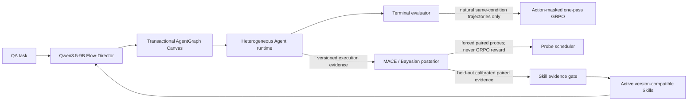

# FlowSteer AgentGraph v1

This directory documents the code architecture built from the FlowSteer, MACE,
MANTA, and SkillFlow references plus the project design note. Reference
documents are design inputs, not runtime instructions.

## What is implemented

AgentGraph v1 is an additive path beside the repository's original Operator
DSL. The legacy trainer and evaluator are intentionally left intact while the
new path establishes stricter execution and evidence invariants.

| Plane | Implemented modules | Current boundary |
| --- | --- | --- |
| Execution | `agent_graph`, `agent_action_parser`, `agent_workflow_env`, `agent_runtime`, `openai_gateway`, `director` | End-to-end inference works with fake or OpenAI-compatible gateways |
| Policy learning | `grpo_objective`, `records` | Auditable one-pass objective exists; it is not yet wired into the legacy GPU trainer |
| Exploration | `exploration/features`, `mace`, `posterior`, `policies`, `paired_probe`, `evsi` | Statistical primitives are implemented; real same-prefix continuation workers remain to be connected |
| Skills | `skills/schema`, `validator`, `store`, `retrieval`, `lifecycle` | Deterministic evidence gates and lifecycle work; automatic mining and confirmatory job scheduling are future work |
| Evidence | `persistence/ids`, `trajectory_store`, `replay`, `versioning` | Versioned JSONL streams, idempotency, split isolation, and snapshot hash-chain replay are implemented |

The design deliberately keeps three signals separate:



## Hard invariants

- Agent IDs are unique, model IDs come from the catalog, and contracts are
  non-empty.
- Relations are two directed bits: independent, either one-way direction, or
  bidirectional.
- A bidirectional block contains at most two Agents and executes as two frozen
  stages: parallel drafts, then parallel revisions over the peer's draft.
- The quotient graph is acyclic; every block reaches one output block, which is
  a sink.
- The Director emits one strict JSON action per turn. The parser consumes only
  the first action boundary.
- GRPO groups use `(task_id, condition_id, policy_version)`. Singleton and
  constant-reward groups have zero advantage.
- Forced probes, fallbacks, manual repairs, reconstructed contexts, invalid
  evaluators, and mismatched behavior receipts are excluded from GRPO.
- A natural trajectory contributes no more than one terminal posterior
  likelihood. Local effects come primarily from paired interventions.
- Test examples cannot enter probe, posterior-fitting, calibration, or Skill
  evidence streams.
- A Skill is structured and version-bound. It activates only after held-out
  evidence passes deterministic gates and only in a later exploration epoch.

## Three-GPU layout on this server

The setup selected currently idle physical GPUs 3, 4, and 5. Each process sees
its assigned physical card as local `cuda:0`.

| Physical GPU | Role | Default environment variable |
| ---: | --- | --- |
| 3 | Qwen3.5-9B Flow-Director LoRA/GRPO training | `FLOWSTEER_TRAIN_GPU` |
| 4 | Qwen3.5-9B vLLM inference service | `FLOWSTEER_INFERENCE_GPU` |
| 5 | paired-probe, posterior/Skill validation, or auxiliary training worker | `FLOWSTEER_PROBE_GPU` |

Validate availability:

```bash
python3 scripts/check_gpu_plan.py
```

Run an arbitrary process under one role without relying on ambiguous device
numbering:

```bash
scripts/run_on_gpu_role.sh train python3 your_training_entry.py
scripts/run_on_gpu_role.sh probe python3 your_probe_worker.py
```

Start the Director inference service:

```bash
export QWEN35_9B_MODEL_PATH=/absolute/path/to/Qwen3.5-9B
scripts/start_qwen35_director_server.sh
```

## API model catalog

No credential is stored in the repository. Copy the templates and set keys only
in the process environment:

```bash
cp config/model_catalog.yaml.example config/model_catalog.yaml
export VECTOR_ENGINE_API_KEY='...'
export VECTOR_ENGINE_BASE_URL='https://api.vectorengine.ai/v1'
python3 scripts/discover_models.py
```

Use the discovery output to replace provider-specific model IDs in the local
catalog. The checked-in preference weights favor Qwen3.5-9B, DeepSeek Flash,
GPT-4o mini, Gemini Flash, Grok fast, and MiniMax fast, while preserving seeded
random selection for reproducibility. These aliases are configuration defaults,
not a claim that every provider exposes those exact IDs.

Validate config, catalog, and GPU assignments:

```bash
python3 scripts/validate_agentgraph_setup.py
```

## Inference smoke run

After the Qwen Director endpoint is running and the remote catalog IDs are
verified:

```bash
python3 scripts/run_agentgraph.py \
  "Solve the problem and return a concise final answer" \
  --show-graph
```

The inference loop gives the Director a weighted cheap/fast model prior but does
not hard-code a role enum. The Director can create free-text Agent contracts,
choose models, set communication directions, choose the output Agent, repair an
invalid partial graph, and explicitly finish.

## Verification

The lightweight architecture tests need Python 3.10, NumPy, and PyYAML; they do
not download models or call paid APIs:

```bash
python3 -m unittest discover -s tests/unit -p 'test_*.py' -v
python3 -m compileall -q src scripts tests
```

## Deliberately unfinished work

The following are not represented as complete experimental results:

- wiring exact vLLM prompt/output token receipts and LoRA synchronization into
  the new AgentGraph GPU trainer;
- implementing a durable distributed same-prefix fork/continuation job queue;
- training the proposed low-rank feature encoder and performing clustered
  conformal calibration under adaptive probing;
- automatic Skill candidate mining, multiple-discovery control, and real
  memory-on/memory-off evaluation;
- real training, provider integration, benchmark, latency, and cost runs.

This boundary is intentional: the current code is a tested architecture/MVP,
not a claim that the full research loop has already been trained or validated.
