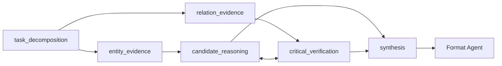

# HotpotQA 三题复杂非链式 AgentGraph 测试报告

## 1. 实验设置

从既有 v9.5 confirmation subset 按顺序选取前 3 个样本，不按答案或结果筛选。
所有 Agent 固定使用本地 Qwen3.5-9B；temperature=0、top-p=1、seed=20260816。
本实验直接执行固定 AgentGraph，没有调用 Flow-Director，没有训练、GRPO、LoRA
update 或 Skill update。

复杂图包含 7 个 Agents、8 条 relations、9 条 directed edges 和 1 个 reciprocal
pair。每题执行 9 次模型调用，其中 reciprocal block 包含两个并行 draft calls 和两个
并行 revision calls。

Topology statistics：

- topology family：`mixed`
- topology motifs：`parallel`, `fan_in`, `fan_out`, `reciprocal`
- structural depth：5
- maximum width：2
- reciprocal pair count：1

## 2. 逐题结果

| Task | Question | Ground Truth | Final Answer | EM | F1 | API calls | Total tokens | Latency |
|---|---|---|---|---:|---:|---:|---:|---:|
| `5ab51d...` | Which musician, Edwyn Collins or Jimmie Ross, played the bass guitar? | `Jimmie Ross` | `Jimmie Ross` | 1.0 | 1.0 | 9 | 13,879 | 9,663.71 ms |
| `5ae3cf...` | What is the 3112 acre Pennsylvania state park ... called? | `Presque Isle` | `Presque Isle State Park` | 0.0 | 0.6667 | 9 | 20,119 | 8,749.08 ms |
| `5adffc...` | Teri W. Odom is a member of a scientific journal first published in 2007 by who? | `the American Chemical Society` | `American Chemical Society` | 1.0 | 1.0 | 9 | 19,777 | 7,359.16 ms |

Aggregate：

- valid trajectories：3/3
- exact match：2/3 = 66.67%
- mean token F1：88.89%
- API calls：27
- prompt tokens：48,347
- completion tokens：5,428
- total tokens：53,775
- accumulated wall-clock latency：25,771.95 ms

## 3. Agent communication

### Task 1：Jimmie Ross

`task_decomposition` 把问题分解为 Edwyn Collins 与 Jimmie Ross 两个 candidate
checks；两个 evidence Agents 并行确认 `Jimmie Ross` 是 bassist。reciprocal block 的
两个 draft 均选择 `Jimmie Ross`，revision 后仍一致；`synthesis` 与 `Format Agent`
输出正确答案。

### Task 2：Presque Isle

两个 evidence Agents 都识别出 passage entity `Presque Isle State Park`；两个 draft、
两个 revision 和 `synthesis` 均保留完整实体名。`Format Agent` 正确抽取上游语义答案，
但未将完整实体名缩写为 reference string `Presque Isle`，因此 official-compatible
answer EM 为 0、F1 为 2/3。该答案也与既有 Direct 和自然串行 AgentGraph 的输出相同，
所以不是 reciprocal communication 引入的新错误。

### Task 3：American Chemical Society

两个 evidence branches 分别确认 `Teri W. Odom → ACS Nano` 与
`ACS Nano → American Chemical Society`；reciprocal revision 没有发现冲突，
`synthesis` 建立完整 bridge relation，`Format Agent` 输出正确答案。HotpotQA 官方
normalization 去除冠词，因此 `American Chemical Society` 与 reference 中的
`the American Chemical Society` 构成 exact match。

## 4. 诊断

复杂 topology 的 execution、fan-out、parallel branches、fan-in、reciprocal draft/
revision 和 terminal formatting 全部真实工作，没有 runtime、communication 或 evaluator
failure。但是，这 3 个样本中两个 evidence branches 经常生成高度重叠的 evidence，
reciprocal revision 主要重复确认已有结论，没有改变最终答案。该固定通用图因此增加了
token 和 latency，却没有超过这 3 题既有 Direct/自然串行结果（两者同样为 EM 2/3、
mean F1 88.89%）。

结果说明复杂 topology 不应作为所有 HotpotQA 样本的固定 workflow。Flow-Director
需要根据 question type 和 dependency structure 决定是否采用 parallel evidence
retrieval、fan-in aggregation 或 reciprocal verification，并为每个 branch 生成互补的
task-specific contract；否则会出现 evidence redundancy。是否发布相关 Skill，应通过
更多问题上的 paired comparison 和 independent validation，而不是依据这 3 个 Demo。

完整逐 Agent draft、revision、upstream message、response、token 和 latency receipt：

`artifacts/hotpotqa_multiagent_skill/complex_topology_demo3/complex_topology_trajectories.json`
